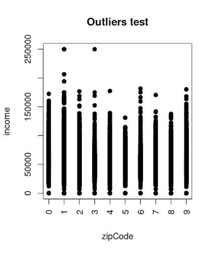
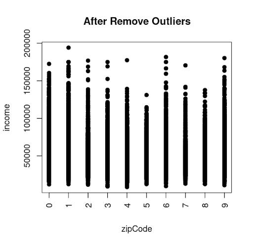
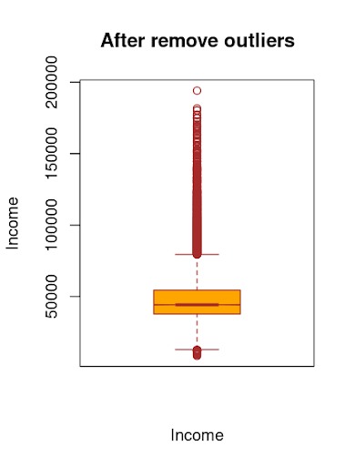
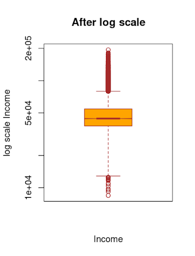
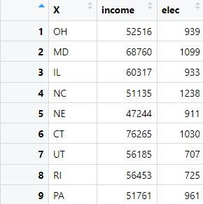
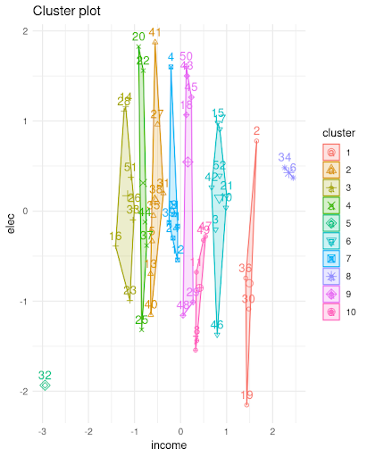
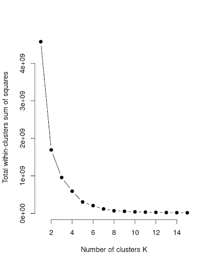
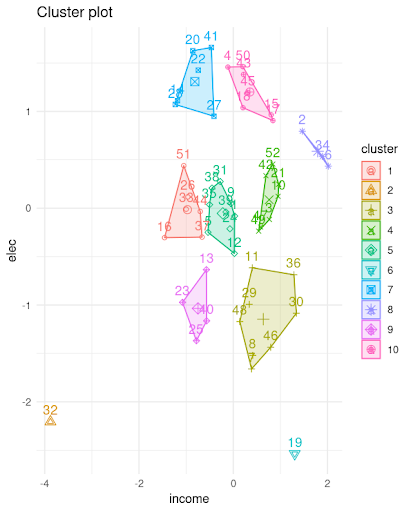
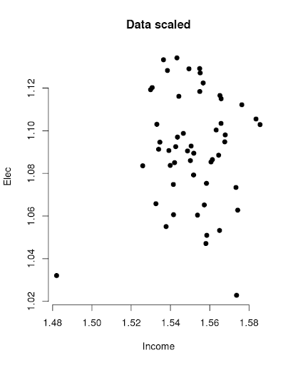
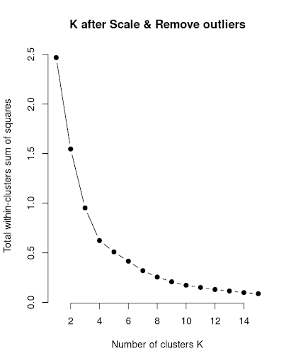

# data science project


### Step 1 : retrieve and clean up data using R

1. "Zcta" "sex" "meanAge" "meanEducation" "meanHouseHoldIncome" "meanEmployment".
1. zeta table has **64076** Rows.
1. we found duplicated rows.

```r
sum(duplicated(csv_data))
```  

4. after removing duplicated data, we found no duplicated rows in zeta_nodupes. Using the same method we did when identifying duplicated Rows.

5. Saved the table.

```r
write.csv(nondup,"E:/RStudio/R projects/“zeta_nodupes.csv", row.names = FALSE)
```  

---

### Step 2: Data Analysis in R
  
1. loading zipIncome.txt into R 

 ```r
my_data <- read.delim2("E:/RStudio/R projects/zipIncome.txt", header = TRUE, sep = ",", dec = ",")
```

2. Change the cognomen name zcta becomes zipCode 

```r
colnames(my_data)[2] <- "income"
colnames(my_data)[1] <- "zipCode"
```

3. mean = **48,245.24**  , median = **44,163**

```r
DatawithmeanIncome = transform(my_data, income  = as.numeric(income))
summary(DatawithmeanIncome)
```

```output
 zipCode          income      
 Min.   :0.000   Min.   :     0  
 1st Qu.:2.000   1st Qu.: 37644  
 Median :4.000   Median : 44163  
 Mean   :4.473   Mean   : 48245  
 3rd Qu.:7.000   3rd Qu.: 54373  
 Max.   :9.000   Max.   :250000

```

4. yes, income values greater than **200,000**

```r
x <- DataWithmeanIncome$zipCode
y <- DataWithmeanIncome$income

plot(x, y, main = "Outliers test",
     xlab = "zipCode", ylab = "income",
     pch = 19, frame = TRUE, xaxt="n")
axis(1, at = seq(0, 10, by = 1), las=2)

```

```r
summary(DataAfterRemoveOutliers)

zipCode          income      
 Min.   :0.000   Min.   :  8465  
 1st Qu.:2.000   1st Qu.: 37755  
 Median :4.000   Median : 44234  
 Mean   :4.474   Mean   : 48465  
 3rd Qu.:7.000   3rd Qu.: 54444  
 Max.   :9.000   Max.   :194135 

```

>

5. In order to **Omit** outliers, we created a subset of data that income between $7,000 && $200,000

```r
# data without outliers 
DataAfterRemoveOutliers<-DataWithmeanIncome[(DataWithmeanIncome$income>7000 & DataWithmeanIncome$income<200000),]
```

6. scatter after omitting outliers

```r
x <- DataAfterRemoveOutliers$zipCode
y <- DataAfterRemoveOutliers$income

plot(x, y, main = "After Remove Outliers",
     xlab = "zipCode", ylab = "income",
     pch = 19, frame = TRUE, xaxt="n")
axis(1, at = seq(0, 10, by = 1), las=2)

```

>

7. new mean **48,465**

---

###  step 3: Visualize you data

1. Creating a simple box plot of the data.

```r
boxplot(DataAfterRemoveOutliers$income,
        main = "After remove outliers",
        xlab = "Income",
        ylab = "Income",
        col = "orange",
        border = "brown",
        horizontal = FALSE,
        notch = TRUE
)
```

>

2. we noticed form the box plot, all the income data is pushed towards the bottom of the graph due to most average incomes tend to be low. In effort to fix this we created a new box plot where the y-axis and x-axis us a log scale.

```r
boxplot(DataAfterRemoveOutliers$income,
        main = "After log scale",
        xlab = "Income",
        ylab = "log scale Income",
        col = "orange",
        border = "brown",
        horizontal = FALSE,
        notch = TRUE,
        log='y'
)

```

>

3. **To conclude**, outliers are unexpected numbers in a dataset that might cause statistical analysis to be skewed and assumptions to be shattered.

---

# K-means

1. accessing data saved in "income_elect_state.csv" and creating table

```r
data <- read.csv(file = 'income_elec_state.csv')
> head(data, n = 5)
   X income elec
1 OH  52516  939
2 MD  68760 1099
3 IL  60317  933
4 NC  51135 1238
5 NE  47244  911

```

>

2. cluster the data using k-means and plotting all 52 data points, with 10 clusters. 

```r
km <- kmeans(data, 10, nstart=50,iter.max = 15 )

fviz_cluster(km, data = data, ellipse.type ="convex",
             xlab = "income", ylab = "elec")+
  theme_minimal()
```

>

3. determining a reasonable value of k using **elbow** method k = 6

```r
k.max <- 15

elbow_method <- sapply(1:k.max, 
              function(k){kmeans(data, k, nstart=50,iter.max = 15 )$tot.withinss})

plot(1:k.max, elbow_method,
     type="b", pch = 19, frame = FALSE, 
     xlab="Number of clusters K",
     ylab="Total within-clusters sum of squares")

```

>

4. By converting the mean of household income and mean electricity usage to a log10 scale and cluster this transformed dataset, we found the shape of clusters due the change of the distribution of data 

```r

# scale income and mean electricity usage to log10 
data_sacled <- data
data_sacled$income <- log10(data_sacled$income)
data_sacled$elec <- log10(data_sacled$elec)

km <- kmeans(data, 10, nstart=50,iter.max = 15 )

fviz_cluster(km, data = data, ellipse.type ="convex",
             xlab = "income", ylab = "elec")+
  theme_minimal()
```

>

5. reevaluating our choice of k. yes, due to the normalization of data k = 5

```r
elbow_method <- sapply(1:k.max, 
                       function(k){kmeans(scaled_data, k, nstart=50,iter.max = 15 )$tot.withinss})

plot(1:k.max, elbow_method,
     type="b", pch = 19, frame = FALSE, 
     main="log(10) scale",
     xlab="Number of clusters K",
     ylab="Total within-clusters sum of squares")

```

> 

6. by removing outlier we observed in the data and reevaluating the choice of k = 4

```r
R <- dataloged[(dataloged$income>10.5&dataloged$elec > 6.5),]
```

>
> 